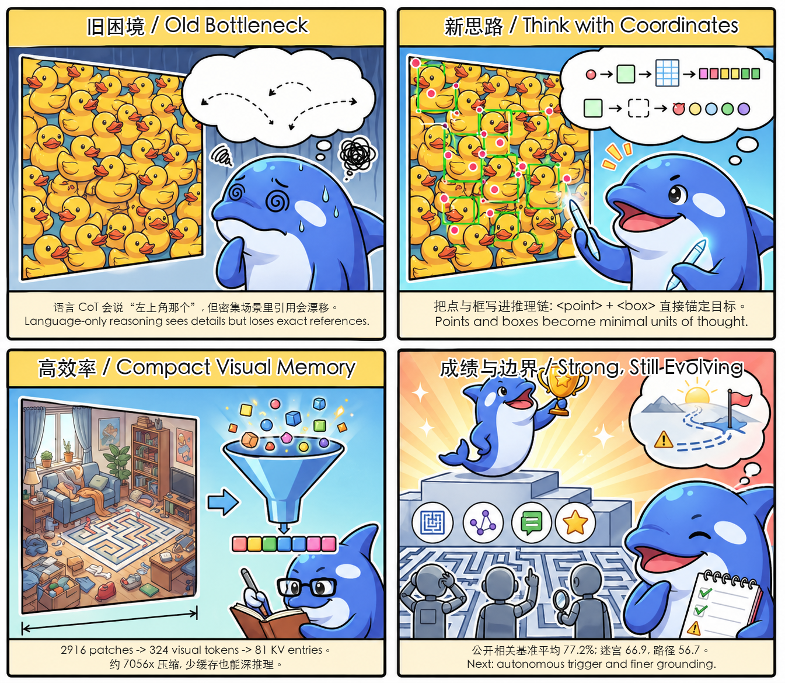

# Thinking with Visual Primitives: Bilingual Reading Notes / 中英双语论文解读

This document is an added reading guide for the archived paper. It is intentionally separate from `README.md`, which is kept as the recovered snapshot README.

本文档是对归档论文的补充解读，刻意与 `README.md` 分离；`README.md` 保持为找回的快照原始版本。

## Paper Reading in One Picture / 一图读懂

<p align="center">
  
</p>

## Core Idea / 核心思想

| Topic | English | 中文 |
|---|---|---|
| Problem | Language-only Chain-of-Thought can describe objects, but it often fails to reference exact visual locations in dense or spatially complex scenes. | 纯语言思维链可以描述物体，但在密集计数、复杂空间关系、多步推理中，常常“指不准”具体位置。 |
| Bottleneck | The paper calls this the **Reference Gap**: natural language is an ambiguous pointer for continuous visual space. | 论文把这个瓶颈称为 **Reference Gap**：自然语言在连续图像空间里不是精确指针。 |
| Mechanism | Treat **points** and **bounding boxes** as minimal reasoning units, interleaving them with text in the thinking process. | 把 **点** 和 **边界框** 当作最小推理单元，和文本一起交织进思考过程。 |
| Intuition | Humans often count, navigate, and compare by pointing. The model imitates this point-to-reason behavior. | 人类数东西、走迷宫、比位置时会用手指辅助定位；模型也应该学会“指着想”。 |
| Claim | Precise reference can improve counting, spatial reasoning, and topological reasoning with much lower visual-token usage. | 精确引用能在更低视觉 token 成本下提升计数、空间推理和拓扑推理能力。 |

## Method Summary / 方法概览

**Architecture.** The model follows a LLaVA-like vision-language architecture. Images are encoded by an in-house **DeepSeek-ViT**, then concatenated with language instructions and processed by **DeepSeek-V4-Flash**, a MoE language backbone with **284B total parameters** and **13B active parameters** during inference.

**架构。** 模型采用类似 LLaVA 的视觉语言结构：图像先经内部训练的 **DeepSeek-ViT** 编码，再与语言指令拼接，送入 **DeepSeek-V4-Flash**。该语言底座是 MoE 模型，推理时总参数 **284B**，激活参数 **13B**。

**Visual-token efficiency.** For a 756 x 756 image, the paper reports this compression path:

```text
571,536 pixels
-> 2,916 ViT patch tokens
-> 324 visual tokens after 3 x 3 spatial compression
-> 81 visual KV-cache entries after Compressed Sparse Attention
-> about 7,056x compression from pixels to final KV entries
```

**视觉 token 效率。** 论文给出的 756 x 756 图像示例中，视觉信息经过 `patch -> 空间压缩 -> CSA KV 缓存压缩` 后，从 2,916 个 patch token 压到 81 个视觉 KV 条目，整体约 **7056 倍压缩**。这也是论文很强调的一点：不是堆大量视觉 token，而是用更紧凑的视觉记忆支撑更深推理。

**Primitive formats.**

```text
Bounding box:
<|ref|>TARGET<|/ref|><|box|>[[x1,y1,x2,y2], ...]<|/box|>

Point:
<|point|>[[x1,y1], [x2,y2], ...]<|/point|>
```

**视觉原语格式。** 边界框负责“这个物体在哪里、有多大”，点负责更抽象的定位、路径、轨迹和拓扑导航。坐标被归一化到 0-999 的整数范围。

## Training Pipeline / 训练流程

| Stage | English | 中文 |
|---|---|---|
| Pretraining | Learn basic visual primitive generation from large-scale multimodal data and grounding datasets. | 通过大规模多模态数据和 grounding 数据，先学会输出点与框。 |
| Specialized SFT | Train separate specialists for box-based grounding and point-based reasoning. | 分别训练“用框思考”和“用点思考”的 SFT 专家。 |
| Specialized RL | Apply GRPO with task-specific rewards for format, quality, counting accuracy, maze validity, and path tracing. | 用 GRPO 做专门强化学习，奖励覆盖格式、质量、计数准确性、迷宫合法性、路径追踪等。 |
| Unified RFT | Use expert rollouts to build a richer RFT dataset and train a unified model from the base checkpoint. | 用专家模型 rollout 生成更丰富数据，再从底座训练统一模型。 |
| On-Policy Distillation | Distill specialist capabilities back into one model with full-vocabulary logit distillation. | 用 OPD 把专家能力蒸馏回单一模型。 |

**Cold-start task data.** The paper reports roughly **10K** counting samples, **9K** spatial reasoning/general VQA samples, **460K** maze-navigation samples, and **125K** path-tracing samples.

**冷启动任务数据。** 论文报告了约 **1 万** 计数样本、**9 千** 空间推理/通用 VQA 样本、**46 万** 迷宫导航样本和 **12.5 万** 路径追踪样本。

## Evaluation Highlights / 实验亮点

| Benchmark | Metric | Ours | Reading |
|---|---:|---:|---|
| CountQA | EM / RA@10 | 64.9 / 74.1 | Close to Gemini-3-Flash, slightly behind the best reported score. / 接近 Gemini-3-Flash，略低于最高分。 |
| Pixmo-Count | EM | 89.2 | Best reported score. / 论文表中最高。 |
| DS_Finegrained_Counting | EM | 88.7 | Best reported score on the in-house fine-grained counting set. / 自建细粒度计数集最高。 |
| MIHBench | ACC | 85.3 | Best reported score. / 最高。 |
| SpatialMQA | ACC | 69.4 | Best reported score. / 最高。 |
| EmbSpatial | ACC | 83.7 | Tied best with Qwen3-VL. / 与 Qwen3-VL 并列最高。 |
| CV-Bench | ACC | 88.4 | Very close to the best score, Gemini-3-Flash at 88.6. / 接近最高，Gemini-3-Flash 为 88.6。 |
| OmniSpatial | ACC | 59.5 | Essentially tied with Gemini-3-Flash at 59.6. / 基本与 Gemini-3-Flash 的 59.6 持平。 |
| DS_Spatial_Reasoning | ACC | 98.7 | Best reported score. / 自建空间推理集最高。 |
| DS_Maze_Navigation | ACC | 66.9 | Large lead over other tested models around 49-51. / 相比其他模型约 49-51 的成绩有明显优势。 |
| DS_Path_Tracing | ACC | 56.7 | Large lead over the next best, GPT-5.4 at 46.5. / 明显高于第二名 GPT-5.4 的 46.5。 |

Important note from the paper: the **77.2% average score** in Figure 1 covers selected public benchmarks that match the paper's research focus, not a complete measure of overall model capability.

论文特别提醒：Figure 1 中的 **77.2% 平均分** 只覆盖与研究主题直接相关的部分公开基准，不代表模型整体能力的完整排名。

## Why It Matters / 价值与启发

**For multimodal reasoning.** The paper shifts attention from pure perception scaling to reference precision. This is useful for tasks where the hard part is not seeing the object, but consistently referring to the same object across multiple reasoning steps.

**对多模态推理。** 这篇论文把重点从“提高感知分辨率”推进到“提高引用精度”。很多任务的难点不是看不见，而是在多步推理里始终指向同一个对象。

**For AI systems.** Visual primitives are a possible interface between language reasoning and tool-like perception: boxes can anchor objects, points can anchor trajectories, and both can be checked by rule-based or geometric verifiers.

**对 AI 系统。** 视觉原语可以成为语言推理和工具化感知之间的接口：框锚定物体，点锚定轨迹，两者都更容易被规则或几何验证器检查。

**For efficiency.** The architecture suggests that strong spatial reasoning does not always require huge visual-token budgets. Compact visual memory plus precise references can be a practical path.

**对效率。** 论文展示的方向是：强空间推理不一定必须依赖极高视觉 token 预算。紧凑视觉记忆加精确引用，也可能是一条更实用的路线。

## Limitations / 局限性

| Limitation | English | 中文 |
|---|---|---|
| Fine-grained perception | Input resolution still limits precise primitive generation in very fine-grained scenes. | 输入分辨率仍会限制超细粒度场景中的点框精度。 |
| Activation | The current capability depends on explicit trigger words. | 当前能力依赖显式触发词，还不能完全自主决定何时启用。 |
| Topology generalization | Point-based topological reasoning remains difficult and does not fully generalize across scenarios. | 用点做复杂拓扑推理仍然困难，跨场景泛化还有限。 |
| Archive status | The repository README is kept as the recovered snapshot; this file contains the added interpretation. | 仓库 README 保持为找回的快照版本；本文档放置额外解读。 |
